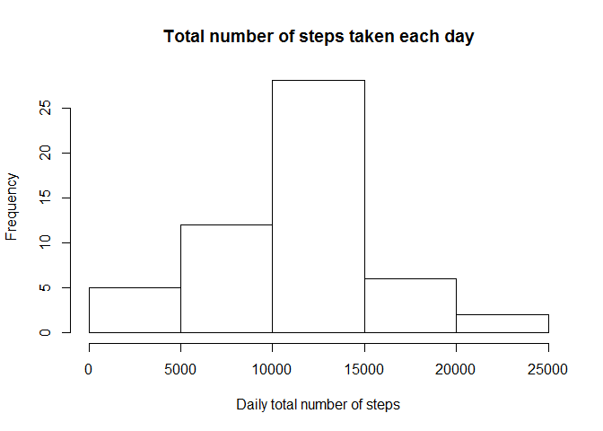
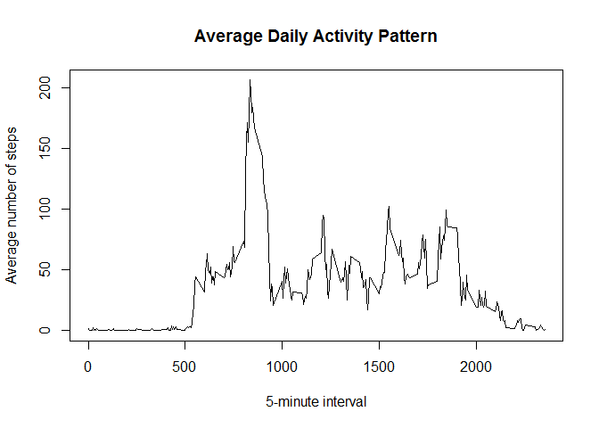
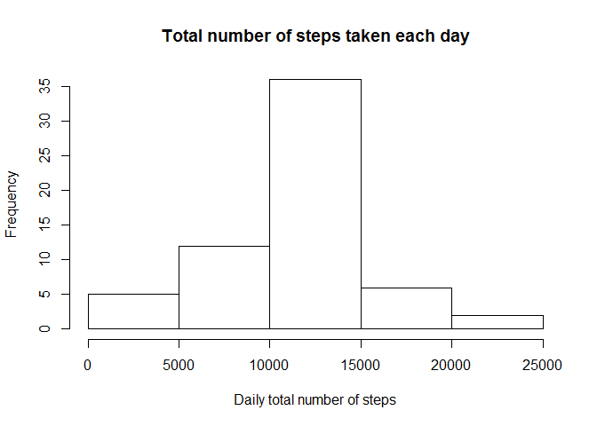
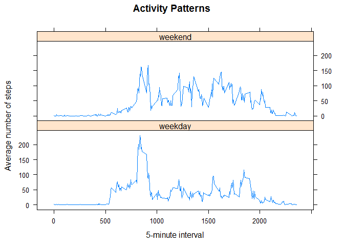

# Reproducible Research: Peer Assessment 1
## 
The source data file for this assignment can be found at the following link:
https://d396qusza40orc.cloudfront.net/repdata%2Fdata%2Factivity.zip

The following analysis will utlize the dplyr package. 

```r
# Load required libraries
suppressMessages(library(dplyr))
```


## Loading and preprocessing the data


```r
# Script assumes you have extracted the data file to your current working directory
activity <- read.csv(".\\activity.csv",header = T, stringsAsFactors = FALSE)
```


## What is mean total number of steps taken per day?

```r
# For this part of the assignment, the missing values in the dataset are ignored

# This code filters the activity set by removing NA's and only returns the steps 
# and date columns
q1 <- activity %>%
        filter(!is.na(steps)) %>%
        select(steps:date) 
        
# This code takes the filtered dataset(q1), groups the data by the date and returns
# the total number of steps taken per day
q1_summary <- q1 %>%
        group_by(date) %>%
        summarize(total_steps = sum(steps))

# This code plots a histogram of the total number of steps taken each day
hist(q1_summary$total_steps, main = "Total number of steps taken each day", xlab = "Daily total number of steps")
```

 

The mean total number of steps taken per day was **10,766**  
The median total number of steps taken per day was **10,765**  
  
  
## What is the average daily activity pattern?

```r
# This code filters the activity set by removing NA's and only returns the steps
# and interval columns
q2 <- activity %>%
    filter(!is.na(steps)) %>%
    select(steps, interval) 

# This code takes the filtered dataset(q2), groups the data by the interval and returns
# the average number of steps taken per interval
q2_summary <- q2 %>%
    group_by(interval) %>%
    summarize(avg_steps = mean(steps))

# This code creates a line graph plotting the average number of steps per each
# daily 5-minute interval
plot(q2_summary$interval, q2_summary$avg_steps, type = "l", xlab = "5-minute interval", 
     ylab="Average number of steps", main = "Average Daily Activity Pattern")
```

 

```r
# This code identifies the 5-minute interval, across all days, that contains
# the maximum number of steps 
max_interval <- q2_summary[q2_summary$avg_steps == max(q2_summary$avg_steps),]
```

The **835th** 5-minute interval, on average across all the days in the dataset, contains the maximum number of steps  
 

## Imputing missing values

```r
# This code calculates the total number of rows with NA's. False indicates
# there is missing data in the row
cc <- table(complete.cases(activity))
cc
```

```
## 
## FALSE  TRUE 
##  2304 15264
```
The total number of missing values in the dataset (i.e. the total number of rows with NAs), is **2304**  


```r
# This code creates a "lookup" to the avg_steps for each 5 minute interval. The 
# activity data is joined to the interval summary created above. The code then 
# evaluates the steps column. If the column contains an NA, the NA is replaced by
# the 5-minute interval average. If the value is not NA, no change is made to the
# initial value
activity2 <- inner_join(activity, q2_summary, by = "interval")
activity2$steps <- ifelse(is.na(activity2$steps), round(activity2$avg_steps), activity2$steps)
# The new dataset(activity2) is equal to the original dataset but with the missing data filled in
activity2 <- select(activity2, -avg_steps)
```


```r
# This code takes the new data set(activity2) with the imputed values, selects the 
# steps and date columns, groups the data by the date and returns the total number
#of steps taken per day
q3 <- activity2 %>%
    select(steps:date) %>%
    group_by(date) %>%
    summarize(total_steps = sum(steps))

# This code plots a histogram of the total number of steps taken each day for the 
# updated data set with the imputed values for the NA's
hist(q3$total_steps, main = "Total number of steps taken each day", xlab = "Daily total number of steps")
```

 

The mean total number of steps taken per day was **10,766**  
The median total number of steps taken per day was **10,762**  

As we can see from the new mean and median values, there is little difference from the 
esitmates in the first part of the assignment. Imputing missing data had little impact 
on the estimates of the total daily number of steps.  


## Are there differences in activity patterns between weekdays and weekends?

```r
# This code creates a new factor variable in the dataset with two levels - 
# "weekday" and "weekend" indicating whether a given date is a weekday or weekend day.
activity2$day_type <- as.factor(ifelse(weekdays(as.Date(activity2$date)) %in% c("Saturday", "Sunday"), "weekend" , "weekday"))

# This code creates a data frame called weekday that groups the activity data
# by the interval and weekend/weekday and summarizes the number of steps to the
# average steps per interval

weekday <- activity2 %>%
    group_by(interval,day_type) %>%
    summarize(avg_steps = mean(steps))

# This code uses the lattice library to make a panel plot containing a time 
# series plot of the 5-minute interval (x-axis) and the average number of steps
# taken, averaged across all weekday days or weekend days (y-axis). 

library(lattice)

xyplot(weekday$avg_steps~weekday$interval | weekday$day_type, type = 'l', layout = c(1, 2),
       xlab = "5-minute interval", ylab = "Average number of steps", 
       main = "Activity Patterns")
```

 


